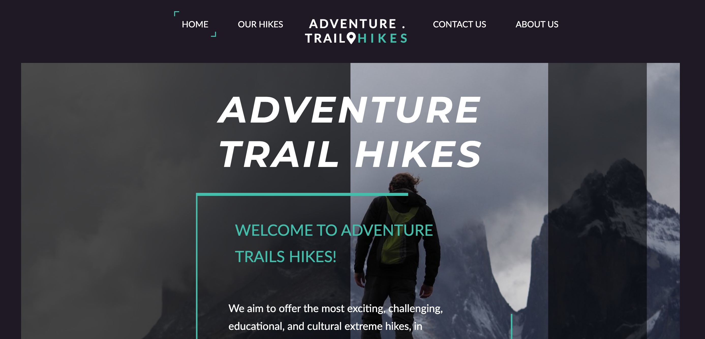

# Project Semester 1

 [](README.md)

A simple overview of the use/purpose of the project.

## Description

this was a website about responsiveness with use of javascript html and css
as the name of the website , this one is for hicking and nature lovers, representing routes and info for hicking in and outside of norway with packages for amateurs of hicking and traveling.

- the home page with hero image gives a clear look and feel for adventure to the user
- the website resprents the option for users to choose routes
- option to search with a high profile filter
- presents locations and trips types in terms of length and duration.

- helping the user by grouping tours and offers with needed info regarding the price, location and duration
- our famous destinations gives a help for users to pick up
- sort hikes , long hikes and camping hikes, with names of locations and starting prices are easily found in the website.
  giving infomation for the user throw faq, and providing informations

- the website contains four pages
- in contact the info in presented with phone and location
- contact posibility via the form
- about us builds more trust and presents the identity of the website.

## Built With

- [HTML]
- [CSS]
- [javascrip]

## Getting Started

### Installing

no instalaltion required

# repo at :

```bash
https://github.com/lacdart2/semester-project1
```

### Running

no running installation needed

## Contact


[My Twitter page](https://twitter.com/LakhdarKader)

[My LinkedIn page](https://www.linkedin.com/in/lakhdar-hafsi-24b31060/)

## Acknowledgments

hicking websites
